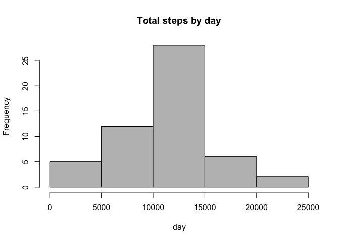
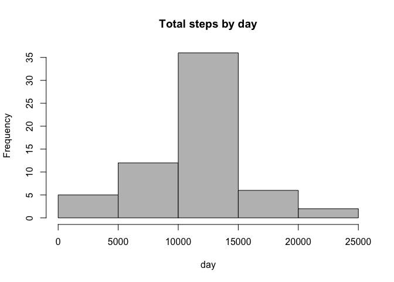

# Reproducible Research: Peer Assessment 1

##Created by Mauro Montauti February 12, 2015

### Loading and preprocessing the data


```r
unzip("activity.zip")
activity <- read.csv("activity.csv", colClasses = c("numeric", "character", 
                                                    "numeric"))
head(activity)
```

```
##   steps       date interval
## 1    NA 2012-10-01        0
## 2    NA 2012-10-01        5
## 3    NA 2012-10-01       10
## 4    NA 2012-10-01       15
## 5    NA 2012-10-01       20
## 6    NA 2012-10-01       25
```

```r
names(activity)
```

```
## [1] "steps"    "date"     "interval"
```

```r
library(lattice)
activity$date <- as.Date(activity$date, "%Y-%m-%d")
```


### What is mean total number of steps taken per day?

Histogram of the total number of steps taken each day

```r
StepsTotal <- aggregate(steps ~ date, data = activity, sum, na.rm = TRUE)
hist(StepsTotal$steps, main = "Total steps by day", xlab = "day", col = "grey")
```

 


Mean

```r
mean(StepsTotal$steps)
```

```
## [1] 10766.19
```

Median

```r
median(StepsTotal$steps)
```

```
## [1] 10765
```


### What is the average daily activity pattern?

* Time series plot

```r
time_series <- tapply(activity$steps, activity$interval, mean, na.rm = TRUE)
plot(row.names(time_series), time_series, type = "l", xlab = "5-min interval", 
    ylab = "Average across all Days", main = "Average number of steps taken", 
    col = "black")
```

 

* Which 5-minute interval, on average across all the days in the dataset, contains the maximum number of steps?


```r
max_interval <- which.max(time_series)
names(max_interval)
```

```
## [1] "835"
```


### Imputing missing values

* Total number of mission values in the dataset

```r
activity_NA <- sum(is.na(activity))
activity_NA
```

```
## [1] 2304
```

* Devise a strategy for filling in all of the missing values in the dataset. The strategy does not need to be sophisticated. For example, you could use the mean/median for that day, or the mean for that 5-minute interval,etc

    Na replaced by mean in 5 min interval


```r
StepsAverage <- aggregate(steps ~ interval, data = activity, FUN = mean)
fillNA <- numeric()
for (i in 1:nrow(activity)) {
    obs <- activity[i, ]
    if (is.na(obs$steps)) {
        steps <- subset(StepsAverage, interval == obs$interval)$steps
    } else {
        steps <- obs$steps
    }
    fillNA <- c(fillNA, steps)
}
```

* Create new dataset

```r
new_activity <- activity
new_activity$steps <- fillNA
```

* Histogram

```r
StepsTotal2 <- aggregate(steps ~ date, data = new_activity, sum, na.rm = TRUE)
hist(StepsTotal2$steps, main = "Total steps by day", xlab = "day", col = "grey")
```

 
 
 * Mean after replacing NAs 

```r
mean(StepsTotal2$steps)
```

```
## [1] 10766.19
```

* Median after replacing NAs 

```r
median(StepsTotal2$steps)
```

```
## [1] 10766.19
```

### Are there differences in activity patterns between weekdays and weekends?

* Create a new factor variable in the dataset with two levels – “weekday” and “weekend” indicating whether a given date is a weekday or weekend day.


```r
day <- weekdays(activity$date)
daylevel <- vector()
for (i in 1:nrow(activity)) {
    if (day[i] == "Saturday") {
        daylevel[i] <- "Weekend"
    } else if (day[i] == "Sunday") {
        daylevel[i] <- "Weekend"
    } else {
        daylevel[i] <- "Weekday"
    }
}
activity$daylevel <- daylevel
activity$daylevel <- factor(activity$daylevel)

stepsByDay <- aggregate(steps ~ interval + daylevel, data = activity, mean)
names(stepsByDay) <- c("interval", "daylevel", "steps")
```

* Panel Plot

```r
xyplot(steps ~ interval | daylevel, stepsByDay, type = "l", layout = c(1, 2), 
    xlab = "Interval", ylab = "Number of steps")
```

 

